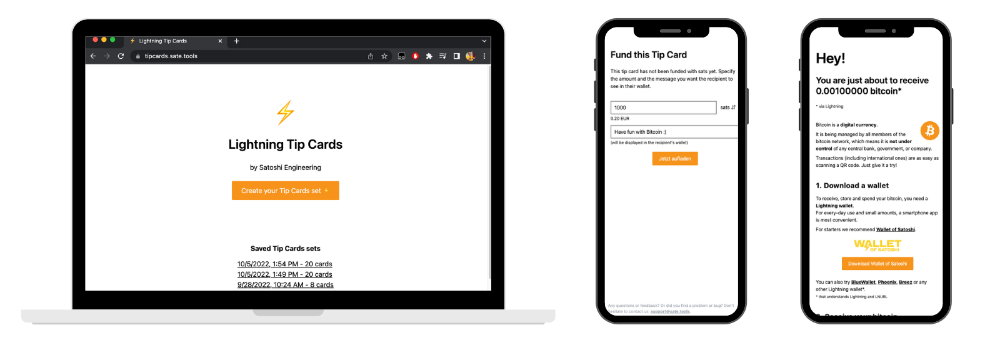

# ⚡️ Lightning Tip Cards
_by [#sathoshiengineeringcrew](https://satoshiengineering.com/)_

[](LICENSE)



# A tip card system based on LNBits and the lightning network

Lightning Tip Cards are a tip (or gift) card system, where you can fund tip cards via the lightning network
and the gifted person can redeem the funded cards. The gifted person gets a short introduction to bitcoin and a lightning
app recommendation to start their journey into the bitcoin rabbit hole.

It is an open-source project developed and operated for the benefit of the Bitcoin community,
with a focus on "How to gentle orange pill nocoiners" - and without warrenty of any kind.

[LNBits](https://github.com/lnbits/lnbits) is used for the wallet and lightning payments in the background.

### Explanation Videos
- Youtube: [How to use lightning tip cards - DE](https://youtu.be/26dj0580HYc)
- Youtube: [How to use lightning tip cards - EN]()
- Youtube: [How to create your set of lightning tip cards - DE](https://youtu.be/Oq__BT6oVoM)
- Youtube: [How to create your set of lightning tip cards - EN]()

`#satohsiengineeringcrew` is `#happy2help`

## Setup for development

### Prerequisites
- [nodejs 16.18.0 LTS](https://nodejs.org/en/)
- npm

### Setup

```bash
npm install
cd frontend && npm install && cd ..
cd backend && npm install && cd ..
```

If you are working at Satoshi Engineering, please configure your GIT repo to use the GIT hooks from  the directory `.githooks`:
```bash
git config core.hooksPath .githooks
```

### Backend

* Setup a redis database on localhost. You can do that by using docker (https://hub.docker.com/_/redis). Just make sure to expose the port 6379 to the host.
* Setting up redis commander is also recommended: https://hub.docker.com/r/rediscommander/redis-commander
  * See [Example](docs/examples/redis) 
* Create your own wallet on https://legend.lnbits.com/.
* Create a `backend/.env` file (or copy it from `backend/.env.example`) and set the following variables:
  - `TIPCARDS_ORIGIN` probably http://localhost:5173 -> where your frontend will be served
  - `TIPCARDS_API_ORIGIN` probably http://localhost:4000 -> where your backend will be served
  - `LNBITS_INVOICE_READ_KEY` paste from your lnbits wallet: get this from https://legend.lnbits.com/wallet and clicking on "API info"
  - `LNBITS_ADMIN_KEY` paste from your lnbits wallet: get this from https://legend.lnbits.com/wallet and clicking on "API info"
* You can look up additional optional variables in `.env.example`

### Frontend

* Create a `frontend/.env.development.local` file  (or copy it from `frontend/.env.development`)  and add the following variable:
  - `VITE_BACKEND_API_ORIGIN` probably http://localhost:4000 -> where your frontend will be served

### Testing

If you want to test the tipcards on your local machine, here are some hints
- Fund your https://legend.lnbits.com/wallet with 1 - 100sats. The tipcard redeeming creates a lightning invoice 
via lnbits and there are transaction costs.
- It won't work with your smartphone, because the development setup restricted to localhost. (And if you use `vite --host` to expose the port,
your lightning apps will refuse to work because there is no ssl connection)
  - We use BlueWallet Deskop app for testing (it can access localhost) 

### VSCode

#### Extensions

* [Vue Language Features (Volar)](https://marketplace.visualstudio.com/items?itemName=johnsoncodehk.volar)
* [PostCSS Language Support](https://marketplace.visualstudio.com/items?itemName=csstools.postcss)
* [Tailwind CSS IntelliSense](https://marketplace.visualstudio.com/items?itemName=bradlc.vscode-tailwindcss)

Do _not_ use Vetur, deinstall it, it was for Vue 2. Volar is recommended by the [Vue 3 Guide](https://vuejs.org/guide/scaling-up/tooling.html#ide-support).  
Do _not_ use the "TypeScript Vue Plugin (Volar)", but use "take over mode" of Volar (see right below).

#### Use Volar's take over mode (disable builtin Typescript extension)

* Make sure "Vue Language Features (Volar)" is installed and activated (see above)
* In the commands input (Cmd/ctrl + shift + P), type in `builtin`
* Click on "Extensions: Show built-in Extensions"
* Search for `typescript`
* Disable "TypeScript and JavaScript Language Support" for Workspace only


## Run from source

Start the frontend server on http://localhost:5173
```bash
cd frontend && npm run dev
```

Start the backend server on http://localhost:4000
```bash
cd backend && npm run dev
```


## Production

Deployment is done via Gitlab CI/CD, see .gitlab-ci.yml

# Tip us

If you like this project, please adapt the landingpage to your local stores, that
accept bitcoin or even extend it. Why not [send some tip love?](https://legend.lnbits.com/tipjar/523)
